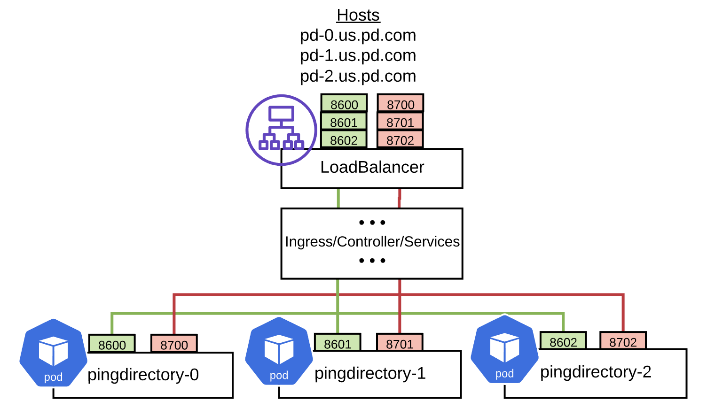
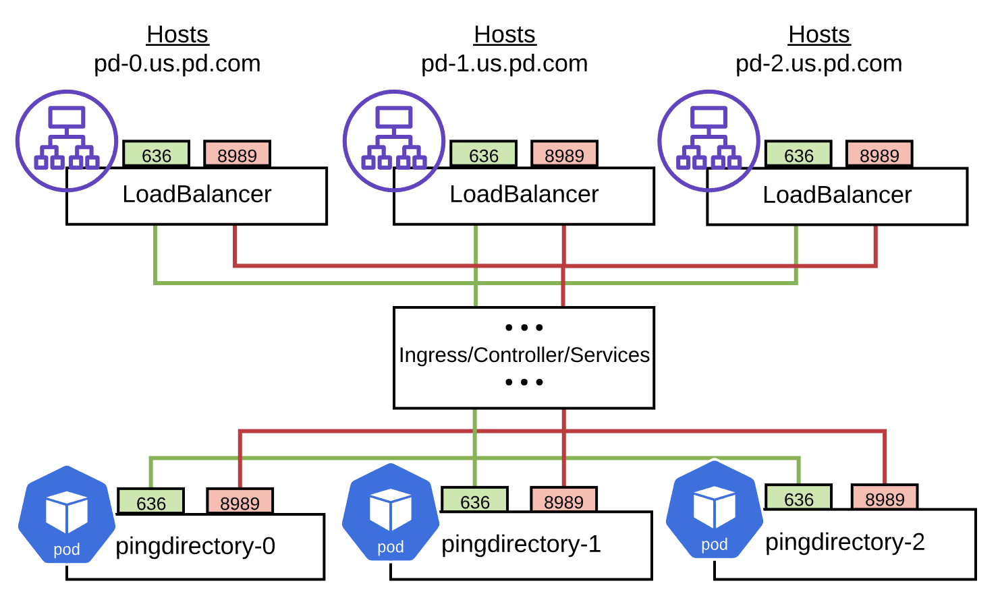
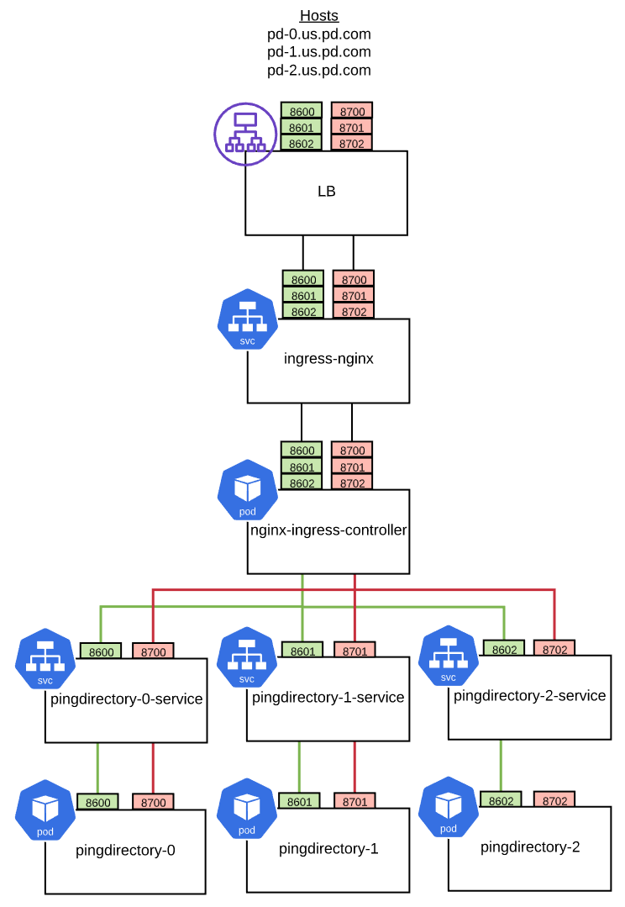

# PingDirectory deployments across Kubernetes clusters

[?? **Needed for this doc: Stepped instructions on how to deploy**.]

This example is an extension of the topic *Orchestrate a replicated PingDirectory deployment* in [Kubernetes orchestration for general use](deployK8sGeneral.md). Here you'll deploy PingDirectory containers across multiple Kubernetes clusters.


Because details within each Kubernetes cluster are well-hidden from outside the cluster, external access to each pod within the cluster is required. The PingDirectory images will set up access to each of the pods using load-balancers from an external host, to allow each pod to communicate over the LDAP and replication protocols.

## Modes of Deployment

There are two types of deployments: using a single load-balancer (such as, AWS NLB), 
or multiple load-balancers.

### Single load-balancer

Here's a diagram of how a single load-balancer can be used:



* Advantages
  * Decreased cost of a single load-balancer.
  * Single IP required.
  * Easier DNS management.
    * Wildcard DNS domain.
    * Or separate hosts pointing to load-balancer.
* Disadvantages
  * More port mapping requirements.
  * Many external ports to manage and track.

### Multiple load-balancers

Here's a diagram of how a single load-balancer can be used:



* Advantages
  * Use the same well-known port (such as, 636/8989).
  * Separate IP addresses per instance.
* Disadvantages
  * DNS management
    * Separate hostname required per instance.

## Environment variables

| Variable | Required | Description |
|---|:---:|---|
| `K8S_CLUSTERS` | *** | The total list of Kubernetes clusters that the StatefulSet will replicate to. |
| `K8S_CLUSTER` | *** | The Kubernetes cluster the StatefulSet will be deployed to. |
| `K8S_SEED_CLUSTER` | *** | The Kubernetes cluster that the seed server is deployed to. |
| `K8S_NUM_REPLICAS` |     | The number of replicas that make up the StatefulSet. |
| `K8S_POD_HOSTNAME_PREFIX` |     | The string used as the prefix for all host names.  Defaults to `StatefulSet`. |
| `K8S_POD_HOSTNAME_SUFFIX` |     | The string used as the suffix for all pod host names.  Defaults to `K8S_CLUSTER`. |
| `K8S_SEED_HOSTNAME_SUFFIX` |     | The string used as the suffix for all seed host names.  Defaults to `K8S_SEED_CLUSTER`. |
| `K8S_INCREMENT_PORTS` |     | `true` or `false`.  If `true`, each pod's port will be incremented by 1. |

An example of the YAML configuration for these environment variables:

```yaml
K8S_STATEFUL_SET_NAME=pingdirectory
K8S_STATEFUL_SET_SERVICE_NAME=pingdirectory

K8S_CLUSTERS=us-east-2 eu-west-1
K8S_CLUSTER=us-east-2
K8S_SEED_CLUSTER=us-east-2
K8S_NUM_REPLICAS=3

K8S_POD_HOSTNAME_PREFIX=pd-
K8S_POD_HOSTNAME_SUFFIX=.us-cluster.ping-devops.com
K8S_SEED_HOSTNAME_SUFFIX=.us-cluster.ping-devops.com

K8S_INCREMENT_PORTS=true
LDAPS_PORT=8600
REPLICATION_PORT=8700
```

These environment variable settings would map out like this:

| Seed | Pod | Instance | Host name | LDAP | REPL |
| :---: | :---: | --- | --- | :---: | :---: |
|      |     | CLUSTER: us-east-2
| ***  | *** | pingdirectory-0.us-east-2 | pd-0.us-cluster.ping-devops.com | 8600  | 8700 |
|      |     | pingdirectory-1.us-east-2 | pd-1.us-cluster.ping-devops.com | 8601  | 8701 |
|      |     | pingdirectory-2.us-east-2 | pd-2.us-cluster.ping-devops.com | 8602  | 8702 |
|      |     | CLUSTER: eu-west-1
|      |     | pingdirectory-0.eu-west-1 | pd-0.eu-cluster.ping-devops.com | 8600  | 8700 |
|      |     | pingdirectory-1.eu-west-1 | pd-1.eu-cluster.ping-devops.com | 8601  | 8701 |
|      |     | pingdirectory-2.eu-west-1 | pd-2.eu-cluster.ping-devops.com | 8602  | 8702 |

## `StatefulSet` pod services

The `StatefulSet` service manages stateful objects for each pod.

An example of the StatefulSet service configuration (one pod):

```yaml
kind: Service
apiVersion: v1
metadata:
  name: pingdirectory-0-service
spec:
  type: ClusterIP
  selector:
    statefulset.kubernetes.io/pod-name: pingdirectory-0
  ports:
    - protocol: TCP
      port: 8600
      targetPort: 8600
      name: ldaps
    - protocol: TCP
      port: 8700
      targetPort: 8700
      name: repl
```

## Additional Kubernetes resources required

In addition to the StatefulSet, other resources are required to properly map the load-balancers to the
pods. This diagram shows each of those resources:



### DNS

A DNS entry will be required at the load-balancer to direct a wildcard domain or individual host names
to the load-balancer created by the NGINX Ingress Service or Controller.  For AWS, this can simply be an `A record` alias for each host, or a wildcard `A record` for any host in that domain.

### NGINX Ingress Service and Controller

Several components map the ports from the external load-balancer through the NGINX Service and Controller:

* External load-balancer

  Provides an external IP and obtains definitions from the Ingress NGINX Service.

* Ingress NGINX Service

  Maps all port ranges (SEED_LDAPS_PORT, SEED_REPLICATION_PORT) to the same target port range.

* NGINX Ingress Controller

  Maps all port ranges to stateful set pods.

> **Caution**: Typically, the NGINX Service and TCP services (see the following *NGINX TCP services* topic) require additional namespace access (such as, `ingress-nginx-public`). Any additional applications using this service or controller will generally require additional privileges to manage this resource.

An example of the NGINX Service configuration:

```yaml
kind: Service
apiVersion: v1
metadata:
  name: ingress-nginx
  labels:
    app.kubernetes.io/name: ingress-nginx
    app.kubernetes.io/part-of: ingress-nginx
    app.kubernetes.io/role: ingress-nginx-public
  namespace: ingress-nginx-public
  annotations:
    service.beta.kubernetes.io/aws-load-balancer-type: nlb
spec:
  selector:
    app.kubernetes.io/name: ingress-nginx
    app.kubernetes.io/part-of: ingress-nginx
    app.kubernetes.io/role: ingress-nginx-public
  externalTrafficPolicy: Local
  type: load-balancer
  ports:
    - name: http
      port: 80
      targetPort: http
    - name: https
      port: 443
      targetPort: https
    - name: ldaps-pingdiretory-0
      port: 8600
      targetPort: 8600
    - name: ldaps-pingdiretory-1
      port: 8601
      targetPort: 8601
    - name: ldaps-pingdiretory-2
      port: 8602
      targetPort: 8602
    - name: repl-pingdiretory-0
      port: 8700
      targetPort: 8700
    - name: repl-pingdiretory-1
      port: 8701
      targetPort: 8701
    - name: repl-pingdiretory-2
      port: 8702
      targetPort: 8702
```

### NGINX TCP services

The ConfigMap for TCP services (`tcp-services`) provides the mappings from the target ports on the NGINX Controller to the associated pod service.

> You'll need to replace the variable `${PING_IDENTITY_K8S_NAMESPACE}` with the namespace that your
 StatefulSet and Services are deployed into.

An example of the ConfigMap for the NGINX TCP services configuration:

```yaml
apiVersion: v1
kind: ConfigMap
metadata:
  name: tcp-services
  namespace: ingress-nginx-public
  labels:
    app.kubernetes.io/name: ingress-nginx
    app.kubernetes.io/part-of: ingress-nginx
    app.kubernetes.io/role: ingress-nginx-public
data:
  8600: "${PING_IDENTITY_K8S_NAMESPACE}/pingdirectory-0-service:8600"
  8601: "${PING_IDENTITY_K8S_NAMESPACE}/pingdirectory-1-service:8601"
  8602: "${PING_IDENTITY_K8S_NAMESPACE}/pingdirectory-2-service:8602"
  8700: "${PING_IDENTITY_K8S_NAMESPACE}/pingdirectory-0-service:8700"
  8701: "${PING_IDENTITY_K8S_NAMESPACE}/pingdirectory-1-service:8701"
  8702: "${PING_IDENTITY_K8S_NAMESPACE}/pingdirectory-2-service:8702"
```


